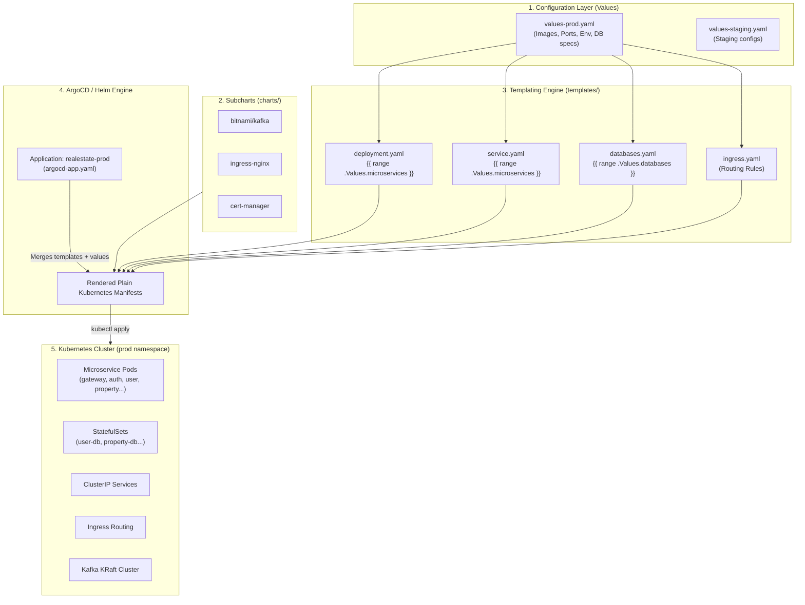

# Helm Chart Architecture & Workflow Guide

This document explains the architecture, resource management, templating engine mechanics, and GitOps workflow of the **`realestate-chart`** repository.

---

## 1. High-Level Concept & Why Helm?

In a microservices architecture with 10+ services and 4 databases, writing individual, static Kubernetes YAML files for every service results in hundreds of duplicated lines (boilerplate):
- Every service needs a `Deployment`, `Service`, health probes, init containers, and environment variables.
- Modifying a single common label, secret name, or config-server URL would require editing dozens of separate files.

**Helm solves this through the DRY (Don't Repeat Yourself) principle:**
- **Dynamic Loops:** A single [`templates/deployment.yaml`](./templates/deployment.yaml) and [`templates/service.yaml`](./templates/service.yaml) loop through a dictionary of microservices defined in a values file.
- **Environment Parity:** The same core templates can be deployed to **staging** or **production** simply by swapping the values file (`values-staging.yaml` vs `values-prod.yaml`).
- **Dependency Packaging:** Third-party infrastructure (Kafka, Nginx Ingress Controller, Cert-Manager) is managed as declared subchart dependencies.



---

## 2. Directory Layout & File Responsibilities

```text
realestate-chart/
├── Chart.yaml                  # Chart metadata and declared subchart dependencies
├── Chart.lock                  # Dependency lockfile tracking exact versions and checksums
├── values-prod.yaml            # Production configuration (images, replica counts, resources)
├── values-staging.yaml         # Staging configuration
├── argocd-app.yaml             # ArgoCD Application manifest targeting this chart
│
├── templates/                  # Helm template files (rendered by the engine)
│   ├── deployment.yaml         # Loops over all microservices to generate Deployments
│   ├── service.yaml            # Loops over all microservices to generate ClusterIP Services
│   ├── databases.yaml          # Loops over all databases to generate StatefulSets & Services
│   ├── ingress.yaml            # Nginx Ingress definitions routing paths to services
│   └── _helpers.tpl            # Optional Helm template helper functions
│
├── charts/                     # Downloaded subcharts (.tgz archives)
│   ├── kafka-31.5.0.tgz        # Bitnami Kafka subchart
│   ├── ingress-nginx-4.10.1.tgz# Nginx ingress controller subchart
│   └── cert-manager-v1.14.4.tgz# Jetstack cert-manager subchart
│
└── sealed-secrets/             # GitOps directory for Bitnami Sealed Secrets
    ├── controller.yaml         # Sealed Secrets CRD and controller manifests
    ├── app-secrets-sealed.yaml # Encrypted microservice credentials
    └── mysql-passwords-sealed.yaml # Encrypted MySQL root password
```

---

## 3. How the Templating Engine Works

### 3.1 The Microservices Loop
Instead of creating 10 different deployment files, [`templates/deployment.yaml`](./templates/deployment.yaml) iterates over `.Values.microservices`:

```yaml
{{- range $serviceName, $serviceConfig := .Values.microservices }}
apiVersion: apps/v1
kind: Deployment
metadata:
  name: {{ $serviceName }}
  labels:
    app: {{ $serviceName }}
spec:
  replicas: {{ $.Values.global.replicaCount }}
  selector:
    matchLabels:
      app: {{ $serviceName }}
  template:
    ...
    spec:
      {{- if $serviceConfig.needsConfigServer }}
      initContainers:
        - name: wait-for-config-server
          image: busybox:1.28
          command: ['sh', '-c', "until nc -z config-service-svc 80; do sleep 2; done"]
      {{- end }}
      containers:
        - name: {{ $serviceName }}-container
          image: "{{ $serviceConfig.image }}:{{ $serviceConfig.tag }}"
          ports:
            - containerPort: {{ $serviceConfig.port }}
          {{- if $serviceConfig.envFromSecret }}
          envFrom:
            - secretRef:
                name: {{ $serviceConfig.envFromSecret }}
          {{- end }}
---
{{- end }}
```

#### Key Templating Features:
1. **Conditional Init Containers (`needsConfigServer`):**  
   Spring Boot microservices crash if the Config Server is not ready when they start up. The template conditionally injects a BusyBox init container that pings `config-service-svc:80` until it is ready before starting the main container.
2. **Dynamic Secret Ingestion (`envFromSecret`):**  
   Services that need credentials (`gateway-service`, `auth-server`, `property-microservice`, etc.) specify `envFromSecret: "app-secrets"`. The template automatically wires `envFrom.secretRef`.
3. **Variable Scope (`$` vs `.`):**  
   Inside the `range` loop, `.` refers to the current microservice item. `$.Values.global` uses the `$` prefix to access the root context from within the loop (e.g. `$.Values.global.replicaCount`).

---

### 3.2 The Microservices Service Loop
Similarly, [`templates/service.yaml`](./templates/service.yaml) generates an internal Kubernetes `Service` for each entry:

```yaml
{{- range $serviceName, $serviceConfig := .Values.microservices }}
apiVersion: v1
kind: Service
metadata:
  name: {{ $serviceName }}-svc
  labels:
    app: {{ $serviceName }}
spec:
  selector:
    app: {{ $serviceName }}
  ports:
    - protocol: TCP
      port: 80
      targetPort: {{ $serviceConfig.port }}
  type: {{ $serviceConfig.serviceType | default "ClusterIP" }}
---
{{- end }}
```
- Maps incoming port `80` to the container's internal port (`8080` for Spring Boot, `5000` for Python Flask/FastAPI, `80` for Angular).
- Creates standardized cluster DNS hostnames like `user-management-service-svc`, `config-service-svc`, etc.

---

### 3.3 The Databases Loop (`StatefulSet`)
In [`templates/databases.yaml`](./templates/databases.yaml), the template loops over `.Values.databases`:

- Creates a **`StatefulSet`** for stable network identifiers and persistent disk bindings.
- Injects `MYSQL_ROOT_PASSWORD` from the `mysql-passwords` Secret.
- Provisions a dedicated headless `Service` (`<db-name>-svc`) with `clusterIP: None` for direct stateful routing.
- Generates `volumeClaimTemplates` with specified disk storage requests (`storage: 500Mi`).

---

### 3.4 Ingress Routing Layer
[`templates/ingress.yaml`](./templates/ingress.yaml) provides the public gateway into the cluster via Nginx:

- **Path `/`** ➔ Routes to `public-app-svc:80` (Angular Frontend).
- **Path `/api/`** ➔ Routes to `gateway-service-svc:80` (Spring Cloud Gateway).
- **Path `/oauth2/`** ➔ Routes to `auth-server-svc:80` (OAuth/Authorization Server).
- **Path `/ws-notifications/`** ➔ Routes to `notification-service-svc:80` with WebSocket proxy timeouts (`3600s`).

---

## 4. Subcharts & Dependency Management

In [`Chart.yaml`](./Chart.yaml), subcharts allow you to embed complete third-party applications:

```yaml
dependencies:
  - name: kafka
    version: 31.5.0
    repository: https://charts.bitnami.com/bitnami
  - name: cert-manager
    version: 1.14.4
    repository: https://charts.jetstack.io
  - name: ingress-nginx
    version: 4.10.1
    repository: https://kubernetes.github.io/ingress-nginx
```

### How Subcharts Work:
1. When you define a dependency, running `helm dependency update` downloads the packaged subchart `.tgz` into `/charts`.
2. **Passing Configuration to Subcharts:**  
   To configure a subchart, you create a top-level key matching the dependency's name in `values-prod.yaml`:
   ```yaml
   # Overriding values for the 'kafka' subchart:
   kafka:
     fullnameOverride: kafka
     controller:
       replicaCount: 1
     listeners:
       client:
         protocol: PLAINTEXT
   ```

### 4.1 Deep Dive: What Actually Exists Inside the `/charts` Folder?

The `/charts` directory functions like a `node_modules` or `vendor` directory, but for Kubernetes Helm charts. Every `.tgz` archive is a **complete, self-contained Helm chart** created and maintained by third parties (like Bitnami or Kubernetes SIGs).

If you unpack `charts/kafka-31.5.0.tgz`, it expands into an entire standalone project with all the templates, scripts, default configurations, and RBAC rules needed to run Kafka:

```text
kafka/
├── Chart.yaml                                # Subchart metadata (version 31.5.0, appVersion 3.9.0)
├── values.yaml                               # Hundreds of default settings (ports, replicas, JVM heap)
├── README.md                                 # Upstream documentation from Bitnami
│
└── templates/                                # Pre-written Kubernetes manifests for Kafka
    │
    ├── controller-eligible/
    │   ├── statefulset.yaml                  # ➔ Creates the `kafka-controller` StatefulSet
    │   ├── svc-headless.yaml                 # ➔ Creates `kafka-controller-headless` Service
    │   ├── configmap.yaml                    # ➔ Creates `kafka-controller-configuration`
    │   └── pdb.yaml                          # ➔ Creates the PodDisruptionBudget
    │
    ├── svc.yaml                              # ➔ Creates the main `kafka` Service (port 9092)
    │
    ├── rbac/                                 # ➔ Creates ServiceAccount `kafka`, Roles, & Bindings
    │   ├── serviceaccount.yaml
    │   └── role.yaml
    │
    ├── provisioning/                         # ➔ Automated topic creation jobs & scripts
    │   └── job.yaml
    │
    └── metrics/                              # ➔ Prometheus / JMX exporter dashboards
        ├── jmx-configmap.yaml
        └── jmx-servicemonitor.yaml
```

### 4.2 The Values Merging Hierarchy

You never need to edit the files inside `/charts/*.tgz` directly. Helm uses a clean two-layer inheritance model:

```
┌────────────────────────────────────────────────────────┐
│  1. Default values inside subchart                      │
│     (e.g., kafka/values.yaml sets replicaCount: 3)     │
└───────────────────────────┬────────────────────────────┘
                            │ (overridden by)
┌───────────────────────────▼────────────────────────────┐
│  2. Your parent values file                            │
│     (values-prod.yaml under 'kafka:' key)              │
└───────────────────────────┬────────────────────────────┘
                            │ (injected into)
┌───────────────────────────▼────────────────────────────┐
│  3. Subchart templates (kafka/templates/*.yaml)        │
└───────────────────────────┬────────────────────────────┘
                            │ (renders)
┌───────────────────────────▼────────────────────────────┐
│  4. Final Kubernetes Manifests applied to cluster      │
└────────────────────────────────────────────────────────┘
```

The other subcharts follow the exact same structure:
- **`ingress-nginx-4.10.1.tgz`**: Contains templates for the Nginx controller Deployment, `IngressClass`, admission webhook jobs, and NodePort services.
- **`cert-manager-v1.14.4.tgz`**: Contains templates for Cert-Manager controller, CA injector, and webhook validating configurations.

---

## 5. The GitOps Workflow with ArgoCD

ArgoCD continuously monitors this Git repository and uses the Helm engine to render and apply changes.

### 5.1 How ArgoCD Evaluates the Chart
📄 **From [`argocd-app.yaml`](./argocd-app.yaml):**
```yaml
spec:
  source:
    repoURL: 'https://github.com/RealEstate-Rental-JunaidUth-version/K8s-Chart.git'
    targetRevision: main
    path: '.'
    helm:
      valueFiles:
        - values-prod.yaml
  destination:
    server: 'https://kubernetes.default.svc'
    namespace: prod
```

When an update occurs:
1. ArgoCD pulls the latest commit from `main`.
2. It executes the equivalent of:
   ```bash
   helm template realestate-prod . -f values-prod.yaml --namespace prod
   ```
3. It compares the rendered output against the live Kubernetes cluster state.
4. It safely applies any changes using `ServerSideApply`.

---

## 6. Daily Operations & Developer Workflows

### How to Add a New Microservice
To deploy a brand new microservice to the cluster, you **do not touch any template files**. You only add an entry to [`values-prod.yaml`](./values-prod.yaml):

```yaml
microservices:
  analytics-service:
    image: junaiduthman/analytics-service
    tag: 1.0.0
    port: 8080
    type: springboot
    needsConfigServer: true
    envFromSecret: "app-secrets"
```
Once committed and pushed, Helm and ArgoCD automatically generate the `Deployment`, `Service`, labels, and secret bindings.

---

### Useful Helm Commands (Troubleshooting & Testing)

#### 1. Dry-Run / Preview Rendered Output locally
Test how Helm renders your templates without touching the Kubernetes cluster:
```bash
helm template test-release . -f values-prod.yaml
```

#### 2. Verify Syntax and Structure
Check for syntax errors, missing variables, or broken indentation:
```bash
helm lint . -f values-prod.yaml
```

#### 3. Update or Refresh Dependencies
Rebuild subcharts when modifying dependencies in `Chart.yaml`:
```bash
helm dependency update .
```

