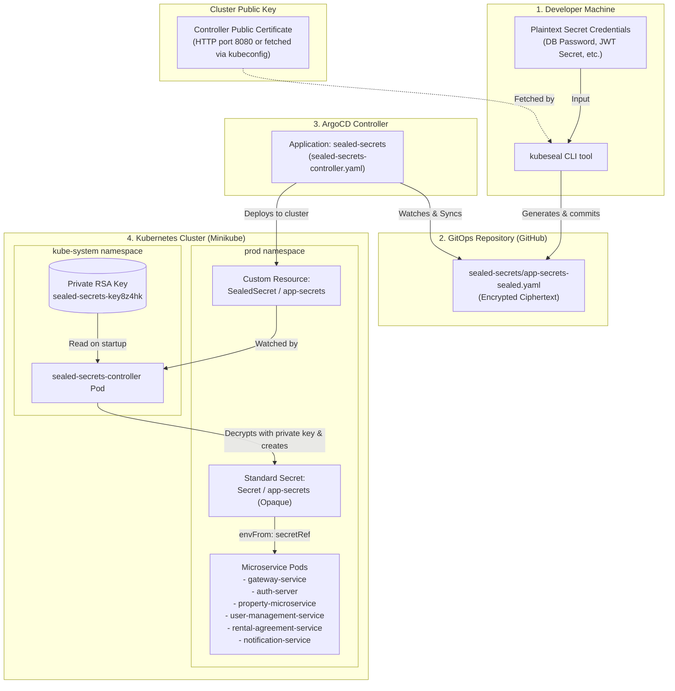

# Bitnami Sealed Secrets Architecture & Lifecycle Guide

This document provides an end-to-end explanation of how secret management works in this repository using **Bitnami Sealed Secrets** and **ArgoCD**.

---

## 1. High-Level Architecture

The core objective of Sealed Secrets is solving the GitOps dilemma: **how to store configuration secrets safely in Git without exposing plaintext values**.

It uses **asymmetric public-key cryptography**:
- **Public Certificate:** Safe to share openly and commit to Git. Anyone can encrypt a secret using this key.
- **Private Key:** Stored strictly inside the Kubernetes cluster in the `kube-system` namespace. Only the `sealed-secrets-controller` pod can access this key to decrypt the secret into a standard Kubernetes `Secret`.



---

## 2. File-by-File Breakdown

### 2.1 ArgoCD Application Definition
📄 **Path:** [`sealed-secrets-controller.yaml`](./sealed-secrets-controller.yaml)

```yaml
apiVersion: argoproj.io/v1alpha1
kind: Application
metadata:
  name: sealed-secrets
  namespace: argocd
spec:
  project: default
  source:
    repoURL: 'https://github.com/RealEstate-Rental-JunaidUth-version/K8s-Chart.git'
    targetRevision: main
    path: sealed-secrets
  destination:
    server: 'https://kubernetes.default.svc'
    namespace: kube-system
  syncPolicy:
    automated:
      prune: true
      selfHeal: true
```

#### Purpose & Mechanism:
- **GitOps Root:** Tells ArgoCD to track the directory `/sealed-secrets` from the Git repository on the `main` branch.
- **Automated Sync:** 
  - `prune: true` ensures that if an encrypted secret is removed from the Git repository, ArgoCD automatically cleans up the corresponding resource from Kubernetes.
  - `selfHeal: true` enforces Git as the single source of truth; if someone manually tampers with or deletes the secret in the cluster, ArgoCD automatically restores it.

---

### 2.2 Controller Infrastructure & CRDs
📄 **Path:** [`sealed-secrets/controller.yaml`](./sealed-secrets/controller.yaml)

This file sets up the entire decryption engine inside the cluster. It contains:

1. **CustomResourceDefinition (`SealedSecret`)**:
   - Registers `sealedsecrets.bitnami.com` with the Kubernetes API server so that Kubernetes recognizes `kind: SealedSecret`.
2. **Controller Deployment (`sealed-secrets-controller`)**:
   - Runs the controller pod (`bitnami/sealed-secrets-controller:v0.40.0`) in `kube-system`.
   - On startup, it inspects `kube-system` for private keys with the label `sealedsecrets.bitnami.com/sealed-secrets-key`.
   - Registers the key (e.g., `sealed-secrets-key8z4hk`) in memory for decryption routines.
3. **RBAC Rules (`ClusterRole`, `ClusterRoleBinding`, `ServiceAccount`)**:
   - Grants the controller permissions across **all** namespaces to watch `SealedSecret` resources and manage corresponding standard `Secret` objects.
4. **Services**:
   - Exposes port `8080` (HTTP) for public key retrieval by the `kubeseal` CLI and port `8081` for Prometheus metrics.

---

### 2.3 The Encrypted Secret
📄 **Path:** [`sealed-secrets/app-secrets-sealed.yaml`](./sealed-secrets/app-secrets-sealed.yaml)

```yaml
apiVersion: bitnami.com/v1alpha1
kind: SealedSecret
metadata:
  name: app-secrets
  namespace: prod
spec:
  encryptedData:
    OAUTH_CLIENT_SECRET: AgCsHRvKM0Alit2DRAUrYn...
    PROD_DB_PASSWORD: AgCYNgkRWdpLxDnb3Ut+pLu40...
    SECRET_KEY: AgCN9V05WnVlJfP9aSvL5gJ5WGP...
  template:
    metadata:
      name: app-secrets
      namespace: prod
    type: Opaque
```

#### Purpose & Mechanism:
- **`metadata.name` & `metadata.namespace`:** Defines where the resulting Secret should be created (`prod` namespace). Bitnami incorporates the target namespace and secret name into the encryption envelope (strict scoping). This prevents an attacker from copying an encrypted string into a different namespace to read it.
- **`encryptedData`:** Holds each individual encrypted value as ciphertext.
- **`template`:** Defines the blueprint for the unsealed Kubernetes `Secret` that the controller will create and keep updated.

---

### 2.4 Microservice Secret Consumption
📄 **Path:** [`templates/deployment.yaml`](./templates/deployment.yaml) & [`values-prod.yaml`](./values-prod.yaml)

In `values-prod.yaml`:
```yaml
microservices:
  gateway-service:
    envFromSecret: "app-secrets"
  auth-server:
    envFromSecret: "app-secrets"
  property-microservice:
    envFromSecret: "app-secrets"
  user-management-service:
    envFromSecret: "app-secrets"
  rental-agreement-microservice:
    envFromSecret: "app-secrets"
  notification-service:
    envFromSecret: "app-secrets"
```

In `templates/deployment.yaml`:
```yaml
{{- if $serviceConfig.envFromSecret }}
envFrom:
  - secretRef:
      name: {{ $serviceConfig.envFromSecret }}
{{- end }}
```

#### Purpose & Mechanism:
- When Helm generates Deployment manifests, any service configured with `envFromSecret: "app-secrets"` gets:
  ```yaml
  envFrom:
    - secretRef:
        name: app-secrets
  ```
- When the container starts, the Kubelet reads `Secret/app-secrets` from the `prod` namespace and exports every key as an environment variable inside the container:
  - `PROD_DB_PASSWORD`
  - `SECRET_KEY`
  - `OAUTH_CLIENT_SECRET`
- Spring Boot microservices read these directly via property resolution in `application.yml` (e.g., `spring.datasource.password: ${PROD_DB_PASSWORD}`).

---

## 3. The Lifecycle from A to Z

### Step A: Developer Encrypts Secrets (Local Machine)
When credentials are created or updated, the developer seals them before touching Git:

```bash
# Generate and seal in a single pipeline without writing plaintext to disk
kubectl create secret generic app-secrets \
  --namespace prod \
  --from-literal=PROD_DB_PASSWORD='your-db-password' \
  --from-literal=SECRET_KEY='your-jwt-secret' \
  --from-literal=OAUTH_CLIENT_SECRET='your-oauth-secret' \
  --dry-run=client -o yaml | \
kubeseal --controller-name=sealed-secrets-controller \
         --controller-namespace=kube-system \
         --format yaml > sealed-secrets/app-secrets-sealed.yaml
```

> [!TIP]
> `kubeseal` automatically connects to your cluster using your current `kubectl` context to fetch the controller's public certificate. If you do not have direct cluster access, you can download the public certificate once (`kubeseal --fetch-cert > pub-cert.pem`) and seal offline using `--cert pub-cert.pem`.

---

### Step B: Commit and Push to Git
The generated file `sealed-secrets/app-secrets-sealed.yaml` contains only ciphertext:

```bash
git add sealed-secrets/app-secrets-sealed.yaml
git commit -m "feat: update sealed application secrets"
git push origin main
```

---

### Step C: ArgoCD Reconciles
1. ArgoCD detects the new commit on branch `main`.
2. The `sealed-secrets` ArgoCD Application compares desired state (Git) against live state (Kubernetes API).
3. ArgoCD issues an API request to apply/update the `SealedSecret` resource in the `prod` namespace.

---

### Step D: The Controller Unseals
1. The `sealed-secrets-controller` pod in `kube-system` has an event watch on `SealedSecret` resources across the cluster.
2. It detects the change to `SealedSecret/app-secrets` in namespace `prod`.
3. It uses its internal private key (`sealed-secrets-key8z4hk`) to decrypt each field under `encryptedData`.
4. It creates/updates the standard Kubernetes `Secret/app-secrets` with:
   - `ownerReferences`: Points to the `SealedSecret/app-secrets` Custom Resource.
   - Decrypted plaintext keys in `data`.
5. Event log generated:
   ```text
   Event: type: 'Normal' reason: 'Unsealed' SealedSecret unsealed successfully
   ```

---

### Step E: Pods Consume Secrets at Runtime
1. Microservice deployments reference `app-secrets` via `envFrom`.
2. Kubelet attaches the environment variables to the container runtime.
3. Applications start and read their database passwords and signing keys securely.

---

## 4. Verification & Useful Debugging Commands

### Check the status of the SealedSecret
```bash
kubectl get sealedsecret app-secrets -n prod -o jsonpath='{.status.conditions[0]}'
# Expected: {"status":"True","type":"Synced"}
```

### Check the generated unsealed Kubernetes Secret
```bash
kubectl get secret app-secrets -n prod
# Expected: NAME          TYPE     DATA   AGE
#           app-secrets   Opaque   3      ...
```

### Confirm Secret Ownership
```bash
kubectl get secret app-secrets -n prod -o jsonpath='{.metadata.ownerReferences[0].kind}'
# Expected: SealedSecret
```

### Inspect Controller Logs
```bash
kubectl logs -n kube-system deployment/sealed-secrets-controller --tail=50
```

---

## 5. Architecture Evolution: Migration from Vault / ESO

Before the migration, the setup used **HashiCorp Vault** combined with **External Secrets Operator (ESO)**:
- `templates/secretstore.yaml` configured a `SecretStore` pointing to Vault (`http://realestate-prod-vault:8200`).
- `templates/app-secrets.yaml` and `templates/db-secret.yaml` declared `ExternalSecret` objects that attempted to pull credentials out of Vault.

### Why It Broke & How It Was Resolved:
1. **Ownership Conflict:** The old `ExternalSecret` owned the `Secret/app-secrets` resource via Kubernetes `ownerReferences`.
2. When the new `SealedSecret` was deployed, the Sealed Secrets controller refused to overwrite a secret managed by another controller, outputting:
   ```text
   failed update: Resource "app-secrets" already exists and is not managed by SealedSecret
   ```
3. **Resolution:**
   - Disabled the old templates by renaming them (`_secretstore.yaml.disabled`, `_app-secrets.yaml.disabled`, `_db-secret.yaml.disabled`) so Helm/ArgoCD will not re-render Vault objects.
   - Removed the stale `ExternalSecret` and `SecretStore` resources from the cluster.
   - Allowed the `sealed-secrets-controller` to take full ownership and unseal `app-secrets` cleanly.

